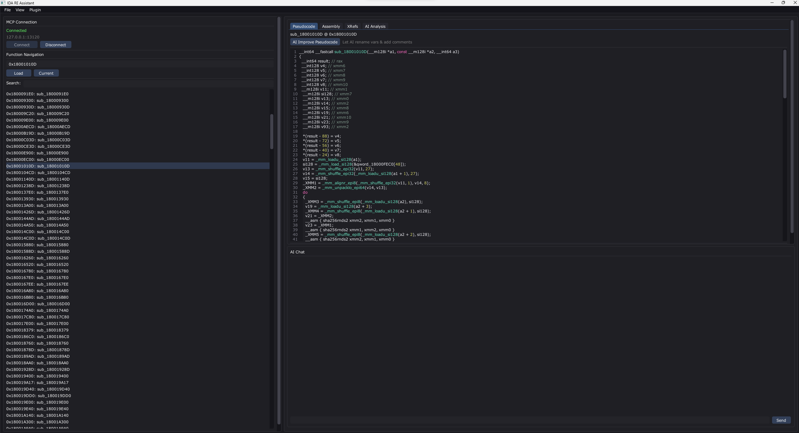
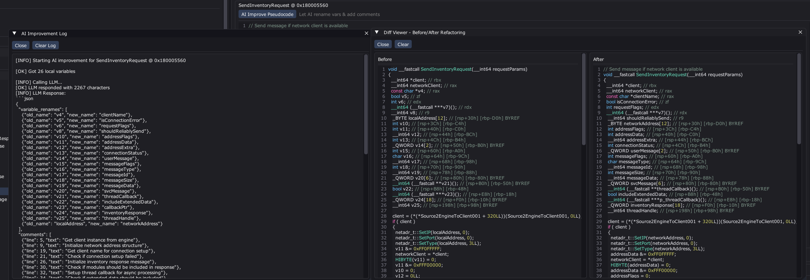
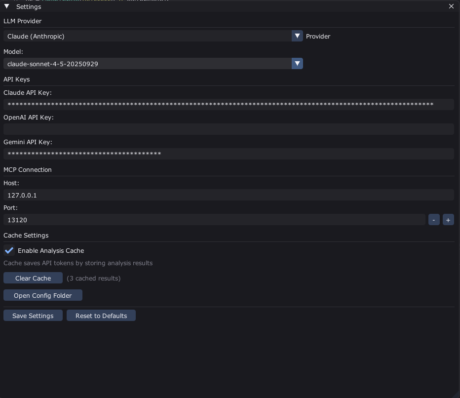
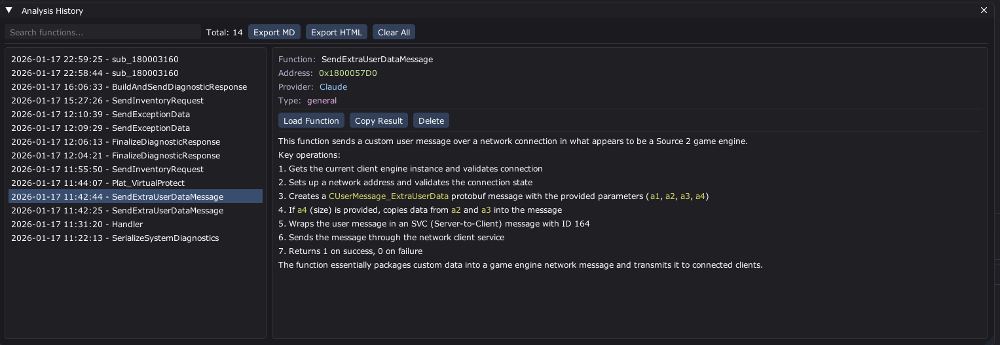
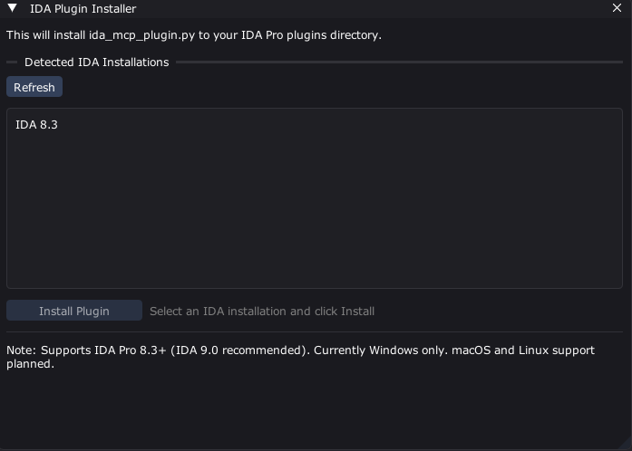
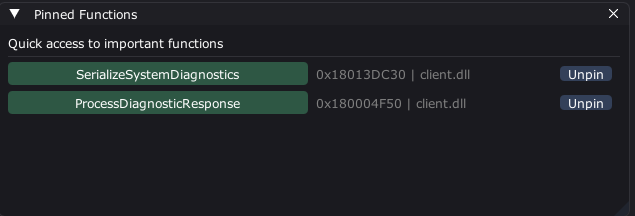
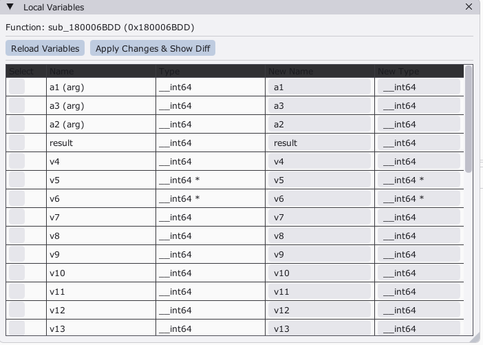
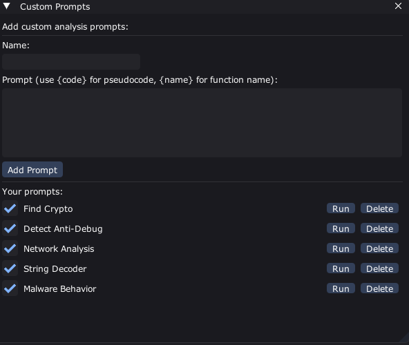
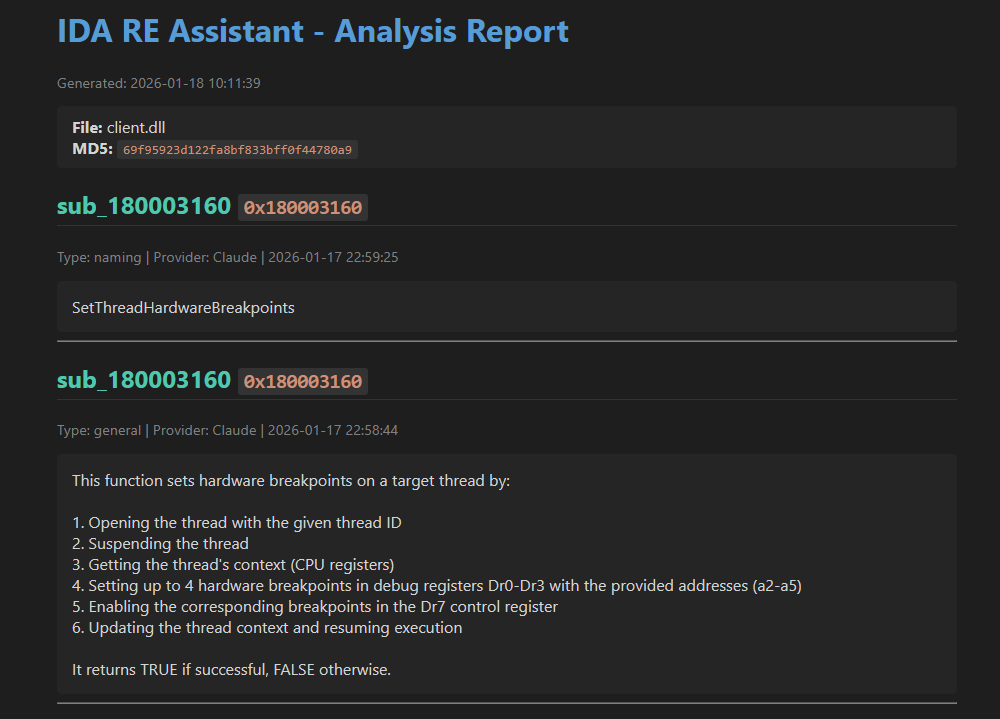
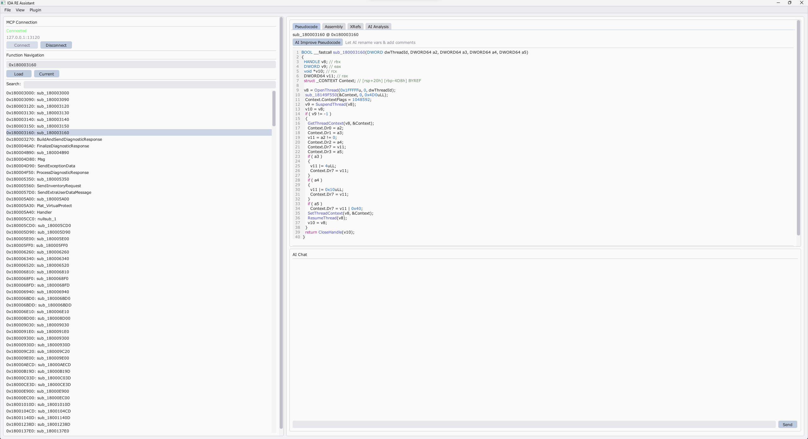

# IDA RE Assistant

AI-powered reverse engineering assistant for IDA Pro with multiple LLM support (Claude, OpenAI, Gemini).

## Screenshots

### Main Interface - Chat & Analysis


*Chat with AI about functions, view pseudocode with syntax highlighting, explore XRefs, and get AI analysis*

### AI Pseudocode Improvement - Diff Viewer


*Before/after comparison showing AI-renamed variables (v3→buffer_size, a2→output_buffer) and added comments*

### Settings - Model Selection


*Choose your LLM provider and specific model (Claude Sonnet 4.5, GPT-4o, Gemini 2.0, etc.)*

### Analysis History - Export Reports


*Save analysis sessions, search through history, export to HTML/Markdown for reporting*

### Plugin Installer - Auto-Detection


*Automatically detect IDA installations and install the plugin with one click*

### Pinned Functions - Quick Access


*Pin important functions for quick navigation and bookmark critical findings*

### Local Variables Panel - Bulk Renaming


*View all local variables, rename multiple at once, and see changes in diff viewer*

### Custom Prompts - Reusable Templates


*Create and manage custom analysis templates for common reverse engineering tasks*

### HTML Export - Professional Reports


*Export analysis history to beautifully formatted HTML reports with syntax highlighting*

### Light Theme - Alternative Color Scheme


*Switch to light theme for different working environments (View → Light Theme)*

## Features

### AI & Analysis
- **Multi-LLM Support** - Claude (Sonnet 4.5, Opus 4.5, 3.5 Sonnet/Haiku), OpenAI (GPT-4o, GPT-4-Turbo), Gemini (2.0 Flash, 1.5 Pro/Flash)
- **MCP Protocol** - Full MCP support for Claude Desktop and other MCP clients
- **Interactive Chat** - Natural language queries about your reverse engineering
- **Function Analysis** - Automatic pseudocode analysis with AI explanations
- **AI Pseudocode Improvement** - One-click variable renaming and comment insertion with diff viewer
- **Analysis History** - Save and export analysis sessions to HTML/Markdown

### IDE Integration
- **Direct IDA Control** - Rename functions/variables, add comments, modify code from chat
- **Local Variables Panel** - View, rename, and retype local variables with bulk apply and diff viewer
- **Custom Prompts** - Create reusable analysis templates
- **Bookmarks & Pins** - Mark important functions for quick access
- **Syntax Highlighting** - C/C++ pseudocode with color themes

### UI & Customization
- **Dark/Light Themes** - Clean dark and light color schemes
- **Diff Viewer** - Side-by-side comparison of AI improvements
- **Plugin Installer** - Auto-detect IDA installations and install plugin with one click

## System Requirements

- **IDA Pro**: 8.3+ (9.0 recommended for best compatibility)
- **Platform**: Windows (macOS and Linux support planned)
- **Python**: 3.8+ (for IDA plugin and MCP server)
- **Visual Studio**: 2019+ with C++23 support (for building client)
- **Hex-Rays Decompiler**: Required for pseudocode features

## Installation


### Quick Start

1. **Clone Repository with Submodules**
   ```bash
   git clone --recursive https://github.com/W1lliam1337/ida-re-assistant
   cd ida-re-assistant
   ```

   Or if already cloned without `--recursive`:
   ```bash
   git submodule update --init --recursive
   ```

2. **Run Setup** (Windows)
   ```bash
   setup.bat
   ```

   The setup menu will guide you through:
   - **[1] Build Client** - Compiles the ImGui client
   - **[2] Install IDA Plugin** - Auto-installs to IDA plugins folder
   - **[3] Setup Claude Desktop** - Configures MCP for Claude Desktop
   - **[4] Start SSE Server** - Launches multi-LLM MCP server
   - **[5] Check Release** - Verifies everything is ready

   Or run individual steps:
   - Build: Choose option 1 in setup menu
   - Install plugin: Choose option 2 or manually copy to:
     - Windows: `%APPDATA%\Hex-Rays\IDA Pro\plugins\`
     - macOS: `~/.idapro/plugins/`
     - Linux: `~/.idapro/plugins/`

3. **Choose Your Mode**:

   **Option A: Standalone Client (Recommended for beginners)**
   - Launch `imgui-client/build/bin/Release/ida_re_assistant.exe`
   - In IDA, press `Ctrl+Shift+M` to start HTTP server
   - Enter API key in client settings
   - Start analyzing!

   **Option B: Claude Desktop (MCP stdio)**
   - Run `mcp-server/install_mcp.bat` → Choose option 1
   - Or: `setup.bat` → Choose option 3
   - Restart Claude Desktop
   - In IDA, press `Ctrl+Shift+M`
   - Use Claude Desktop to interact with IDA

   **Option C: ChatGPT / Gemini (MCP via SSE)**
   - Run `mcp-server/install_mcp.bat` → Choose option 2 for setup instructions
   - Or: `setup.bat` → Choose option 4 to start SSE server
   - In IDA, press `Ctrl+Shift+M`
   - Connect your MCP client to `http://127.0.0.1:13121/sse`

   **Option D: Other MCP Client**
   - Run `mcp-server/install_mcp.bat` → Choose option 3 for config template
   - Use generated `mcp_client_config.json` as reference

## Project Structure

```
ida-re-assistant/
├── imgui-client/          # Standalone C++ GUI client
│   ├── src/
│   │   ├── main.cpp       # Entry point (Win32/DX11)
│   │   ├── ui/            # ImGui interface (.hpp)
│   │   ├── api/           # MCP & LLM API clients (.hpp)
│   │   ├── core/          # Config, installer (.hpp)
│   │   ├── utils/         # Syntax highlighting, history (.hpp)
│   │   └── vendor.hpp     # Platform & compiler detection
│   ├── libs/              # Git submodules
│   │   ├── imgui/         # Dear ImGui
│   │   └── cpp-httplib/   # HTTP/HTTPS library
│   ├── cmake/
│   │   └── vcpkg.cmake    # Auto-bootstrap vcpkg
│   ├── triplets/
│   │   └── x64-windows-static-md.cmake  # vcpkg triplet
│   ├── vcpkg.json         # vcpkg dependencies
│   ├── .clang-format      # Code formatting rules
│   └── CMakeLists.txt
│
├── ida-plugin/            # IDA Python plugin
│   ├── ida_mcp_plugin.py  # Main plugin file
│   └── README.md
│
├── mcp-server/                      # MCP protocol bridges
│   ├── install_mcp.py               # Universal MCP installer
│   ├── install_mcp.bat              # MCP installer launcher
│   ├── mcp_client_config.example.json  # Example MCP config
│   ├── ida_bridge.py                # stdio transport (Claude Desktop)
│   ├── ida_sse_server.py            # SSE transport (multi-LLM)
│   ├── requirements.txt
│   └── requirements_sse.txt
│
├── docs/                            # Documentation
│   ├── images/                      # Screenshots for README
│   ├── QUICK_START.md               # Quick start guide
│   ├── PLATFORM_SUPPORT.md          # Platform info & porting guide
│   └── MCP_SETUP.md                 # Complete MCP setup guide
│
├── setup.bat                        # Interactive setup menu
├── LICENSE                          # MIT License
├── .gitignore                       # Git ignore rules
└── README.md                        # This file
```

## Building from Source


### Prerequisites

**Windows:**
```bash
# Install Visual Studio 2019+ with C++ Desktop Development
# Install CMake 3.20+
# Install Python 3.8+
```

**vcpkg Dependencies** (auto-installed by build.bat):
- nlohmann-json
- cpp-httplib
- freetype
- DirectX 11 SDK (Windows SDK)


### Build Steps

1. **Automated Build (Windows)**
   ```bash
   setup.bat
   # Choose option 1: Build ImGui Client
   ```

2. **Manual Build**
   ```bash
   cd imgui-client

   # Configure
   cmake -B build -S . -DCMAKE_BUILD_TYPE=Release

   # Build
   cmake --build build --config Release

   # Binary will be in: build/bin/Release/ida_re_assistant.exe
   ```

3. **Clean Build**
   ```bash
   cd imgui-client
   rmdir /s /q build
   cd ..
   setup.bat  # Choose option 1
   ```

## Usage Modes


### Mode 1: Standalone ImGui Client

**Best for**: Day-to-day reverse engineering with any LLM provider

1. Start IDA and open your binary
2. Press `Ctrl+Shift+M` in IDA (starts HTTP server on port 13120)
3. Launch `ida_re_assistant.exe`
4. Go to Settings → Configure API keys for your LLM provider
5. Connect to IDA (should auto-connect to localhost:13120)
6. Start chatting or analyzing functions!

**Features:**
- ✅ All LLM providers (Claude, OpenAI, Gemini)
- ✅ Full GUI with syntax highlighting
- ✅ Analysis history with export
- ✅ Custom prompts
- ✅ Bookmarks and pinned functions
- ✅ AI Pseudocode Improvement
- ✅ Diff viewer for changes


### Mode 2: Claude Desktop (MCP stdio)

**Best for**: Claude Desktop users who want native integration

1. Run `mcp-server/install_mcp.bat` → Choose option 1
2. Restart Claude Desktop
3. Open IDA and press `Ctrl+Shift+M`
4. In Claude Desktop, ask: "What functions are in this binary?"
5. Claude can now directly interact with IDA!

**MCP Tools Available:**
- `get_function_pseudocode` - Decompile any function
- `get_function_assembly` - Get assembly code
- `get_function_xrefs` - Get cross-references
- `analyze_function` - Full analysis (pseudo + asm + xrefs)
- `rename_function` - Rename functions
- `rename_local_variable` - Rename local variables
- `set_variable_type` - Set variable types
- `add_function_comment` - Add decompiler comments
- `get_function_local_variables` - List all variables
- And more... (see [docs/MCP_SETUP.md](docs/MCP_SETUP.md) for full list)


### Mode 3: Multi-LLM MCP (SSE)

**Best for**: Using MCP with ChatGPT, Gemini, or custom clients

1. Run `mcp-server/install_mcp.bat` → Choose option 2 for setup instructions
2. Or manually: Install dependencies `pip install -r mcp-server/requirements_sse.txt`
3. Start SSE server: `setup.bat` → Option 4
4. Open IDA and press `Ctrl+Shift+M`
5. Configure your MCP client to connect to: `http://127.0.0.1:13121/sse`

**Supported Clients:**
- ChatGPT with MCP plugin
- Gemini with MCP support
- Any custom MCP client

**For detailed MCP setup, see:** [docs/MCP_SETUP.md](docs/MCP_SETUP.md)

## Configuration


### ImGui Client Settings

Located in: `%APPDATA%/ida-re-assistant/config.json`

```json
{
  "mcp_host": "127.0.0.1",
  "mcp_port": 13120,
  "llm_provider": "gemini",
  "claude_api_key": "sk-...",
  "openai_api_key": "sk-...",
  "gemini_api_key": "..."
}
```

Edit in UI: Settings window in client


### IDA Plugin Settings

The plugin runs an HTTP server on port 13120 by default.

To change port, edit `ida_mcp_plugin.py`:
```python
DEFAULT_PORT = 13120  # Change to your port
```

## AI Pseudocode Improvement

The client can automatically improve pseudocode by:
1. Analyzing function logic
2. Renaming variables to meaningful names
3. Adding explanatory comments

**How to use:**
1. Load a function in the client
2. Click "AI Improve Pseudocode" button
3. Wait for AI analysis
4. Review changes in Diff Viewer
5. Changes are automatically applied to IDA!

**Example:**
```c
// Before
void sub_401000(int a1, char *a2) {
  int v3;
  v3 = a1 + 10;
  strcpy(a2, "data");
}

// After (AI-improved)
void sub_401000(int buffer_size, char *output_buffer) {
  int adjusted_size;  // Calculate adjusted buffer size
  adjusted_size = buffer_size + 10;
  strcpy(output_buffer, "data");  // Copy default data to output
}
```

## Keyboard Shortcuts


### IDA Plugin
- `Ctrl+Shift+M` - Start/Stop MCP HTTP server


### ImGui Client
- `Ctrl+L` - Load current function
- `Ctrl+H` - Show history
- `Ctrl+B` - Show bookmarks
- `Ctrl+,` - Settings

## Troubleshooting


### "Failed to connect to IDA"
- Make sure IDA is running
- Press `Ctrl+Shift+M` in IDA to start the HTTP server
- Check IDA console for "[IDA-MCP] HTTP server started" message
- Verify firewall isn't blocking port 13120


### "Hex-Rays decompiler not available"
- Install Hex-Rays Decompiler license
- Assembly and xrefs still work without it
- Pseudocode features require decompiler


### "Variable rename failed"
- Make sure you're using IDA 8.3+
- IDA 9.0 has best compatibility
- Check that variable name is valid C identifier


### "Comments not applying"
- This is a known issue with some IDA versions
- Disassembly comments always work
- Decompiler comments may fail in some edge cases
- Check AI Improvement Log for details


### Build errors (Windows)
```bash
# Clean vcpkg cache
rmdir /s /q imgui-client\vcpkg

# Clean build directory
rmdir /s /q imgui-client\build

# Rebuild
build.bat
```

## Platform Support

| Platform | Client | IDA Plugin | MCP Server | Status |
|----------|--------|------------|------------|---------|
| Windows  | ✅ Full | ✅ Tested | ✅ Full | **Supported** |
| macOS    | ⚠️ Needs main.cpp update | ✅ Should work | ✅ Full | Planned |
| Linux    | ⚠️ Needs main.cpp update | ✅ Should work | ✅ Full | Planned |

**Note**: macOS and Linux support requires updating `main.cpp` to use platform-specific rendering (Metal for macOS, OpenGL for Linux). The IDA plugin and MCP servers should work on all platforms.

## API Keys

Get API keys from:
- **Claude**: https://console.anthropic.com/
- **OpenAI**: https://platform.openai.com/api-keys
- **Gemini**: https://makersuite.google.com/app/apikey

Enter keys in: Client Settings → API Keys

## Development


### Project Dependencies

**ImGui Client:**
- ImGui (included in libs/)
- nlohmann/json (vcpkg)
- cpp-httplib (vcpkg)
- DirectX 11 (Windows SDK)
- C++23 standard library

**IDA Plugin:**
- IDA Python API
- ida_hexrays module

**MCP Servers:**
- mcp package (stdio transport)
- mcp, starlette, uvicorn, sse-starlette (SSE transport)


### Contributing

1. Fork the repository
2. Create feature branch (`git checkout -b feature/amazing-feature`)
3. Commit changes (`git commit -m 'Add amazing feature'`)
4. Push to branch (`git push origin feature/amazing-feature`)
5. Open Pull Request

## License

MIT License - See LICENSE file for details

## Credits

- **ImGui** - Dear ImGui by Omar Cornut
- **cpp-httplib** - HTTP library by yhirose
- **nlohmann/json** - JSON for Modern C++
- **MCP Protocol** - Model Context Protocol
- **IDA Pro** - Hex-Rays IDA Pro

## Support

- **Issues**: https://github.com/W1lliam1337/ida-re-assistant/issues
- **Discussions**: https://github.com/W1lliam1337/ida-re-assistant/discussions
- **Documentation**: See wiki for detailed guides

## Roadmap

- [ ] macOS and Linux support (main.cpp updates)
- [ ] More AI analysis types (vulnerability detection, pattern recognition)
- [ ] Graph view for function relationships
- [ ] Collaborative analysis (shared sessions)
- [ ] Plugin marketplace for custom prompts
- [ ] Binary diffing with AI insights
- [ ] Automated report generation

---

**Made with ❤️ for the reverse engineering community**
